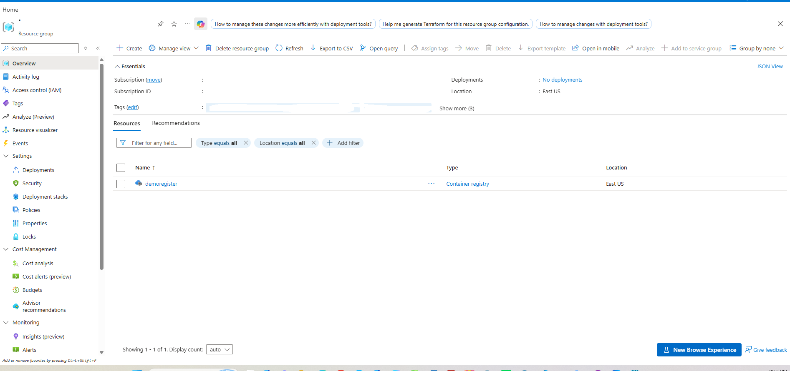
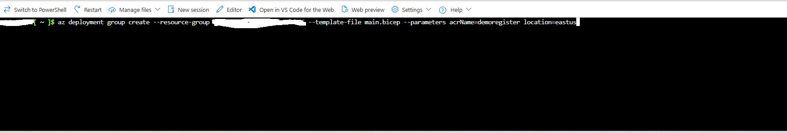
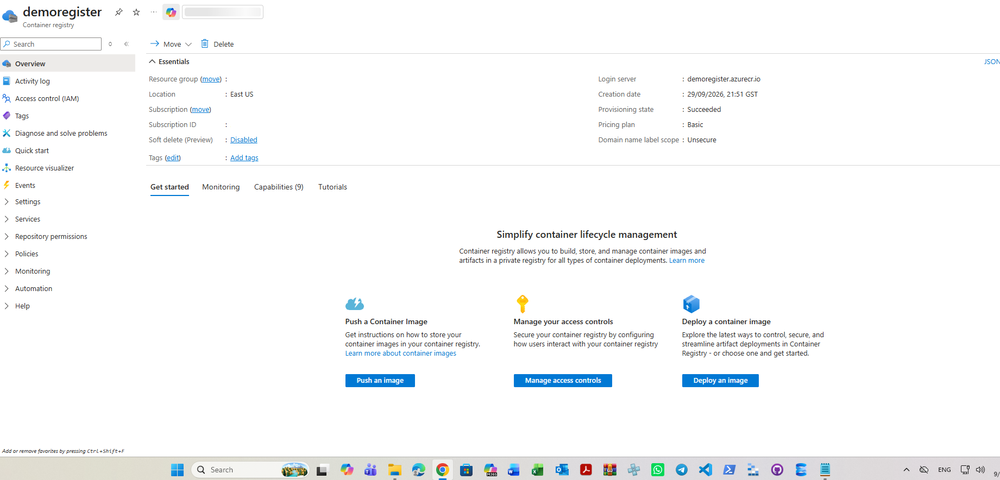

# Declarative Azure Container Registry Deployment via Bicep 

A step-by-step implementation guide detailing the declarative provisioning, parameterization, and verification of an Azure Container Registry (demoregister) using Bicep infrastructure as code.

---

## 1.Architecture & Provisioned Resources

All lab infrastructure was created in the East US region under a dedicated resource group.

* Container registry: demoregister - Basic SKU private container registry configured with public network access, Entra ID authentication, IPv4 protocol endpoints, and standard repository scope maps
* Login server: demoregister.azurecr.io - Fully qualified domain endpoint for authenticating and pushing container artifacts
* Scope maps: Built-in role definitions configured for admin, pull, and push repository operations

*Resource group overview showing the provisioned container registry.*

---

## 2. Step-by-Step Implementation

### Step 1: Deploy Bicep Template via Azure CLI

Initiated an Azure Resource Manager group deployment using the Azure CLI pointing to the declarative Bicep file main.bicep, passing the container registry name demoregister and target location eastus as parameters.

*Deploying the Bicep template using the Azure CLI deployment group command.*

---

### Step 2: Verify Provisioned Container Registry in Resource Group

Confirmed the successful creation and placement of the container registry resource named demoregister in the target resource group located in East US.

*Validating the presence of demoregister inside the resource group inventory.*

---

### Step 3: Inspect Registry Overview & Configuration Essentials

Navigated to the demoregister overview panel in the Azure Portal to confirm that the provisioning state transitioned to Succeeded under the Basic pricing plan with login server demoregister.azurecr.io.

*Inspecting the essentials, login server, and operational state of demoregister in the portal.*

